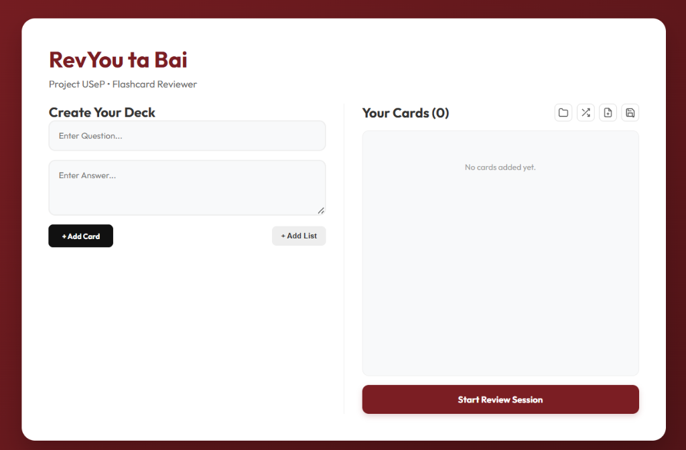

# RevYou ta Bai

**RevYou ta Bai** is a modern, premium flashcard review application designed for **USeP** students. It features a clean, two-tone branding and a streamlined workflow for creating and reviewing study materials.



## ✨ Features

- **Two-Tone Branding**: Elegant Black and Maroon design throughout the app, with high-contrast White/Gold accents in the study sessions.
- **Dynamic Flashcards**: Interactive cards with auto-adjusting font sizes for questions and answers.
- **Bulk Import**: Easily add multiple questions at once using simple JSON formatting.
- **Randomized Review**: Automatic shuffling when restarting a deck to keep your memory sharp.
- **Smart Sessions**: Progress tracking with a completion prompt that lets you restart or move to new topics.

## 🎨 Aesthetic Design

The app uses a curated color palette to ensure readability and a premium feel.


## 🚀 Getting Started

### Prerequisites
- Node.js (Latest)
- npm or yarn

### Installation
1. Clone the repository:
   ```bash
   git clone https://github.com/Peeeweee/Project_RevYou_Ta_Bai.git
   ```
2. Install dependencies:
   ```bash
   npm install
   ```
3. Run the development server:
   ```bash
   npm run dev
   ```

## 🛠️ Tech Stack
- **Framework**: [React](https://reactjs.org/)
- **Build Tool**: [Vite](https://vitejs.dev/)
- **Styling**: Vanilla CSS3
- **Icons**: SVG-based Lucide icons

## 📦 Project Structure
- `src/components/`: Reusable UI components (Flashcard, InputSelection, etc.)
- `src/utils/`: Helper functions for JSON parsing.
- `src/data/`: Default question datasets.

---
*Created for Project USeP • Flashcard Reviewer*
